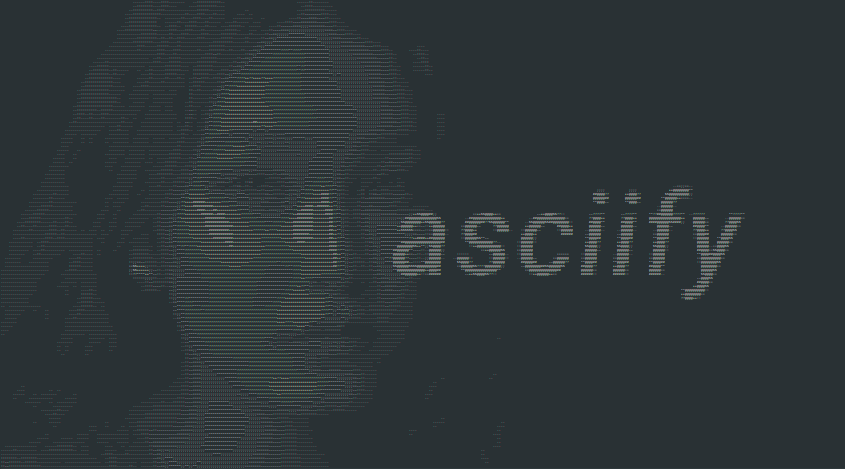

# asciify is a simple command-line tool to create ascii art from .png files. 

Beyond just the input and output files, you can specify:
* Downsampling: Pixels per character
* Supersampling: Amount of pixels to sample for each character, high value -> smoother/blurrier image
* Invert: Specify `0` for bright backgrounds and `1` for dark backgrounds

# Usage

If you're on Windows, there is a precompiled binary in Releases, otherwise you have to [compile it yourself](#Building).

Launch the executable and specify the asked-for parameters (in order). Generally I'd recommend you play around with the Downsampling and Supersampling variables to get the desired look.

# Notes

Not all fonts are created equal. The ["pixel characters" that I decided on using](https://github.com/userexit/asciify/blob/e58d28c4e4e814173fb795570ec77b6a6f8597c0/src/main.cpp#L62) were "tuned" using Consolas, as such there might be other fonts in which the order of the characters should be different. These characeters seemed to work well enough for most monospaced fonts that I've tried however.

Also keep in mind that Notepad++ sometimes stretches the characters at some zoom levels, therefore if you're having issues with the output looking a bit *wonky*, try a different level.

**It absolutely will not work as intended with a non-monospaced font however**
(Though admittedly it can lead to some interesting results. Attempt it at your own peril.)

## Building

Install [premake](https://premake.github.io/download) and use the provided [`premake5.lua`](premake5.lua) file to generate a project. If you want to generate a Visual Studio project you can use the provided [`make_vs.bat`](make_vs.bat) file. 

## Credit
[lodepng](https://github.com/lvandeve/lodepng) by [lvandeve](https://github.com/lvandeve) is used to load bitmaps from .png files.

The photograph used in the background of the title image ([img/title.png](img/title.png)) is [by Aióny Haust and features Aidana Sahari](https://astanatimes.com/2019/09/innovative-kazakh-photographer-draws-inspiration-from-art-music-and-connecting-with-his-subjects/).

## Examples
These images were generated using `invert=1` and with various Downsampling and Supersampling values. They were screenshot in Notepad++ with the Obsidian theme and with the font Consolas.

